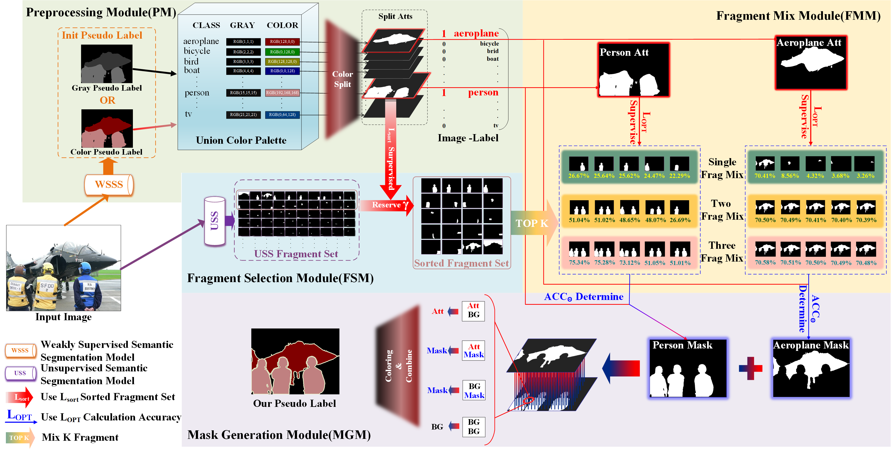

# MABO: Model-Agnostic Boundary Optimization for Weakly Supervised Semantic Segmentation

This repository is the official implementation of "MABO: Model-Agnostic Boundary Optimization for  Weakly Supervised Semantic Segmentation". Please feel free to reach out for any questions or discussions.

## Abstract
Weakly supervised semantic segmentation methods
that rely solely on image level label supervision have gained
significant attention due to their reduced reliance on manual
annotation efforts and resource requirements compared to other
forms of weakly supervised and fully supervised methods. Many
existing approaches utilize class activation maps (CAM) generated
by neural networks to synthesize or generate pseudo labels.
However, the inherent boundary ambiguity in CAM results
in fuzzy boundaries for the synthesized pseudo labels, leading
to suboptimal segmentation network performance.To address
this issue, we leverage the Segment Anything Model (SAM), a
recently released segmentation-based model. The SAM model
effectively tackles the boundary ambiguity of foreground objects
by providing detailed segmentation. However, since the SAM
model lacks category assignments for each foreground instance
object, we employ image level labels and initial pseudo labels
with blurred boundaries generated by various weakly supervised
semantic segmentation methods to provide supervision and obtain
clear boundary pseudo labels. Unlike existing post-processing
modules that are computationally intensive and require extensive
training, such as MARS and AffinityNet [1], our method is highly
efficient and does not involve training additional neural network
models like student-teacher models. Its computational complexity
is negligible, making it lightweight and easily integrable into
any existing weakly supervised semantic segmentation method
without modifying the underlying network or pipeline.Despite its
lightweight, we conducted extensive experiments on the PASCAL
VOC 2012 dataset, evaluating our method with ten advanced
WSSS methods. Our optimized approach achieved significant
improvements, with a maximum enhancement of 7.7% in pseudo
label quality and 3.2% in segmentation performance.

## Pre Generated Data

- Fragment set
    - [Fragment set](https://drive.google.com/file/d/17rbhX_WQU7SWFtNURP_dCQ6MmmJqoWiw/view?usp=drive_link) generated by [SAM](https://github.com/facebookresearch/segment-anything)

## Enhancement

Our code is coming soon.

## Evaluation

| Method | Dataset | Segmentation | valid | test | 
|:------:|:-------:|:------------:|:-----:|:----:|
| MABO | Pascal VOC 2012 | DeeplabV2(Res101) | 76.17%[link](http://host.robots.ox.ac.uk:8080/anonymous/VV2G1N.html) | 76.19%[link](http://host.robots.ox.ac.uk:8080/anonymous/KKXXBD.html) |

## Results

### Comparison before and after mask enhancement

### Comparison before and after segmentation prediction

